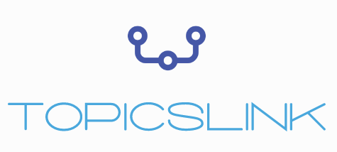
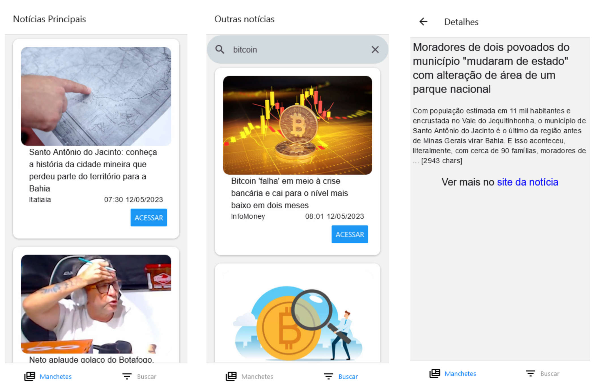

# TopicsLink
<div align="center">
  <a href="#">
    
  </a>
</div>


## 📋 Sobre o Projeto
O aplicativo TopicsLink agrega as principais notícias do Brasil, possibilitando a busca por palavras-chaves. Ele consome a GNewsAPI, que retorna um JSON contendo notícias disponíveis na web. As notícias são apresentadas em uma lista e cada uma tem a imagem, o nome do site, a data de publicação e um botão para ver mais. Ao clicar no botão de ‘Acessar’, você é direcionado para a tela de detalhes da notícia, contendo a descrição, uma parte do conteúdo e o link para o site original da notícia.




## :key: Variáveis de Ambiente

Para rodar esse projeto, você vai precisar adicionar as seguintes variáveis de ambiente no seu .env

`GNEWS_API_KEY=`

## :gear: Rodando localmente

Clone o projeto

```bash
  git clone https://github.com/caducoder/TopicsLink-App.git
```

Entre no diretório do projeto

```bash
  cd TopicsLink-App/
```

Instale as dependências

```bash
  npm install
```

Inicie a aplicação

```bash
  npm run web
```

### :hammer_and_wrench: Tecnologias utilizadas
* 

* 

* 